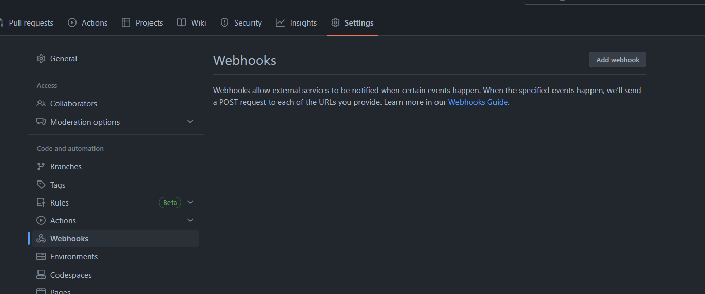
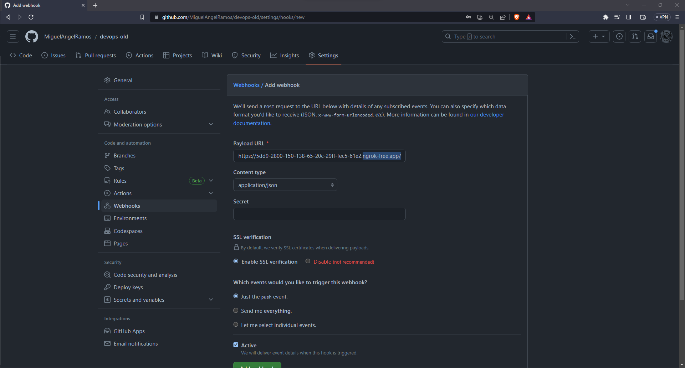
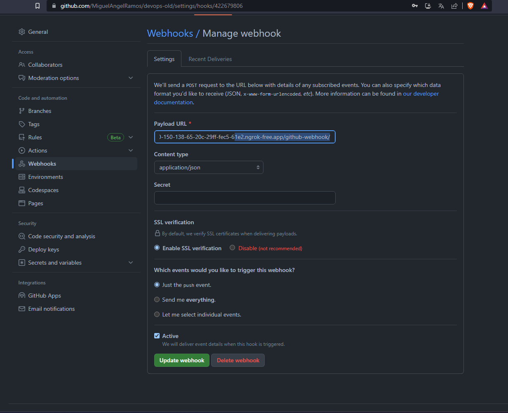
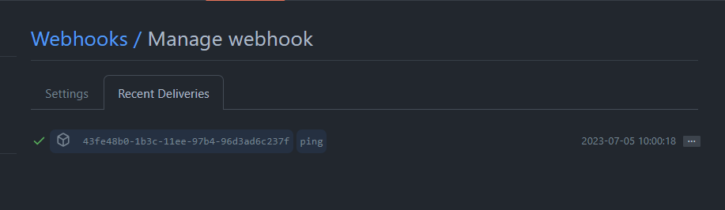
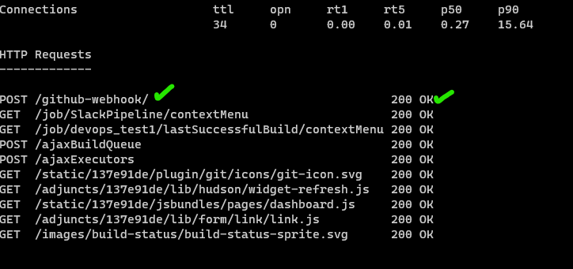

## Instalamos ngrok

Vamos a exponer jenkins para que sea accesible desde internet, lo hacemos con el puerto 8080, ya que es el puerto que utiliza jenkins

```
  ngrok http 8080
```

## Vamos GitHub 

Settings -> WebHooks -> Add webhook 








Luego en nuestro repositorio de github que tenemos en local vamos a crear una nueva rama

## Crear una nueva rama
```sh
git branch "nuevarama"
```
```sh
git checkout nuevarama
```
```sh
git add .
```
```sh
git commit -m "add new branch nuevarama"
```
```sh
git push -u origin nuevarama
```