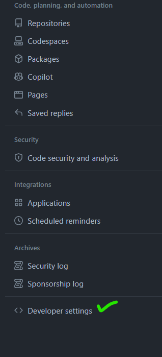
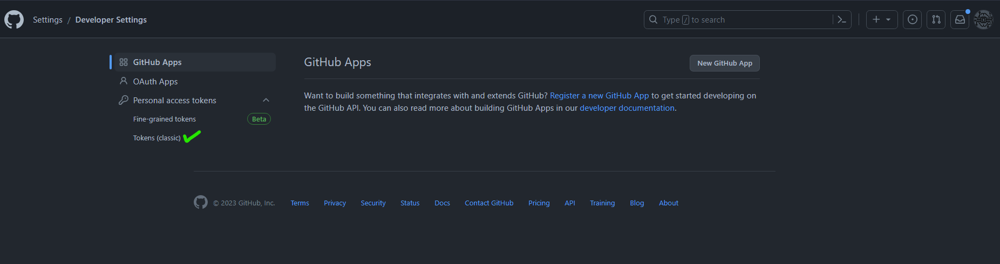
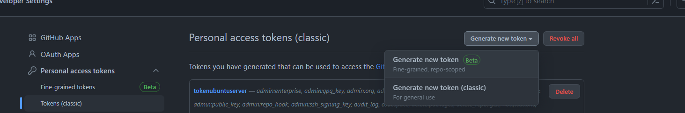
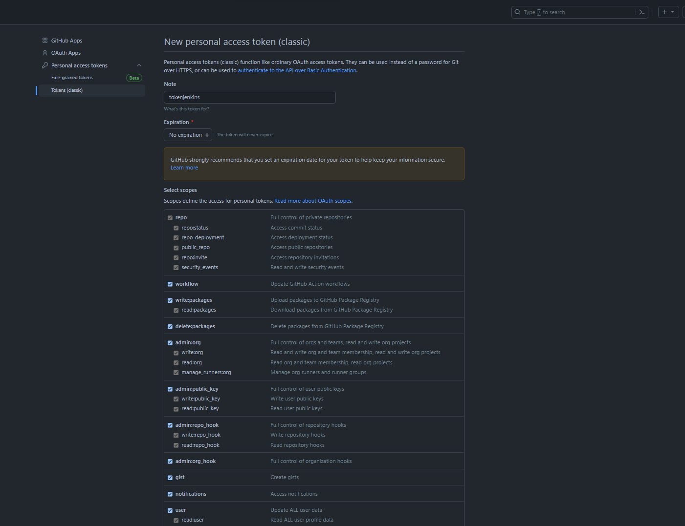
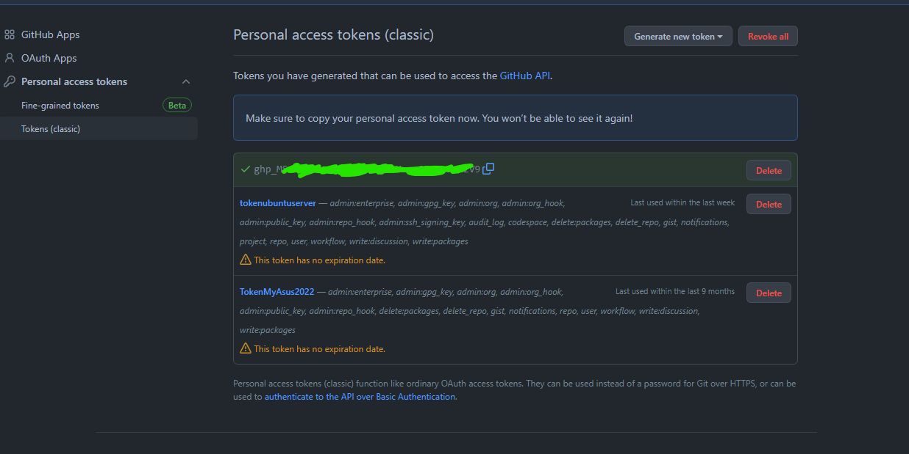
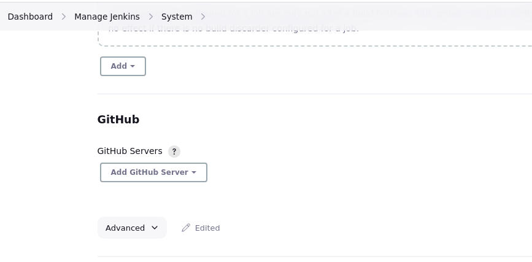
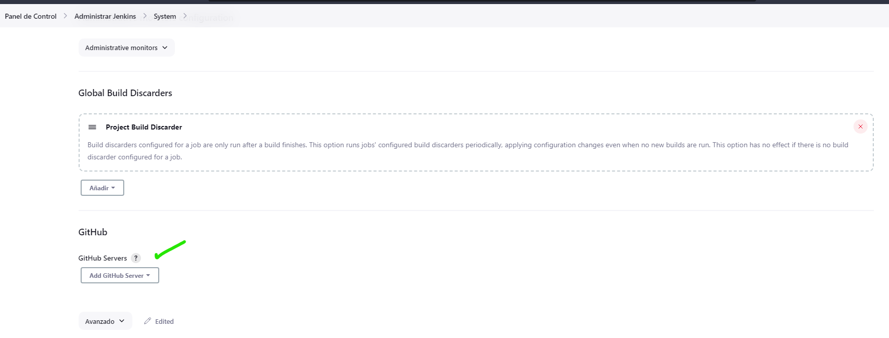

## Creamos un Token en GitHub

Vamos hacia https://github.com/settings/profile

En la ultima opción que dice "Developer Setting"

Luego seleccionar la parte de generar un token clasico 

Luego generas un nuevo token.

Donde dice "Token name" -> Escribes un nombre significativo para tu token de manera de saber cual es y que previlegios le vas a dar.

Puedes escojer el tiempo de Expiration del token

Al final de esta pagina encontraras un botón que te dice "Generate Token", al darle click deberias obtener tu token de acceso.

## Luego en Jenkins

Vamos a configurar el GitHubServer  

