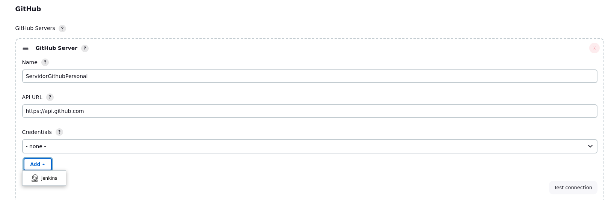
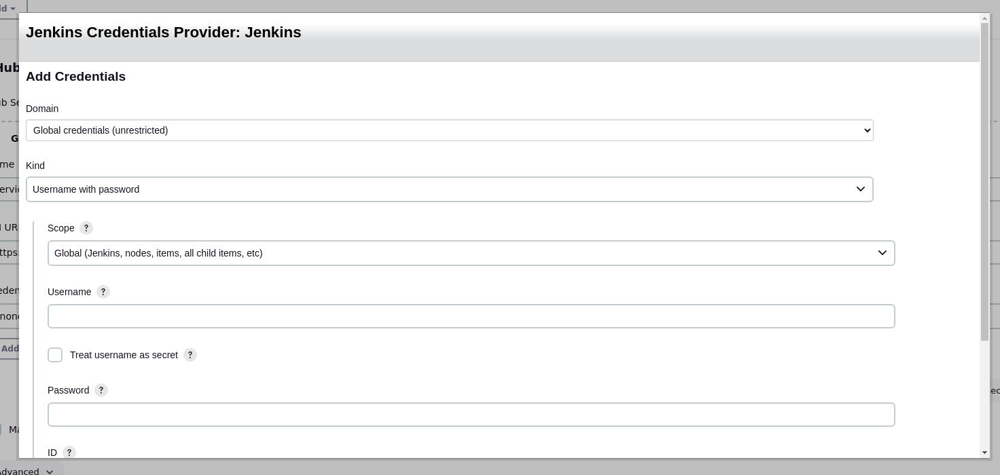

## GithubServer

1. Continuando con esta parte nos vamos a dirigir a la siguiente opcion add -> Jenkins

2. Luego ingresamos las credenciales

3. Donde dice Kind seleccionar "Secret Text" y en ID "GithubToken"

4. Donde dice Secret "ingresa el token que te dio github"

5. Vas al final y presiona dar click en el boton "Add"

6. Selecciona tu credencial GitHubToken y has el "Test de connection"

7. Le das a Guardar