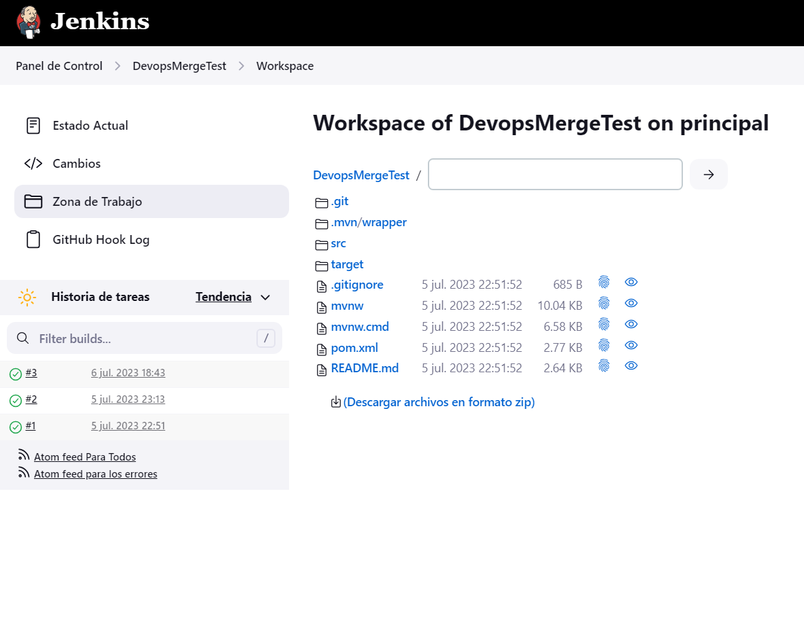
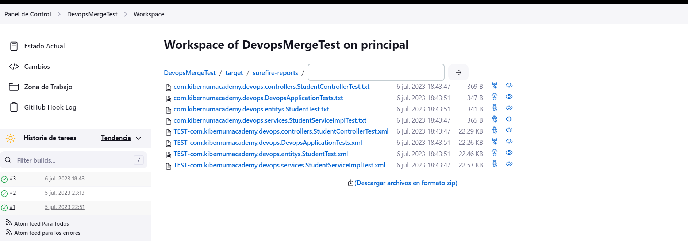
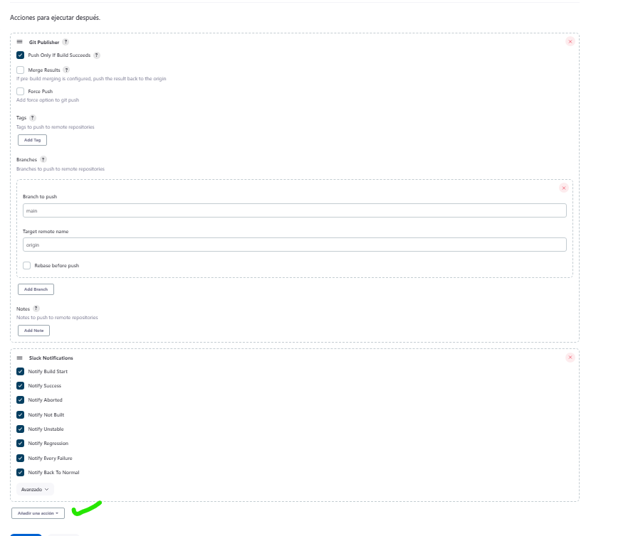
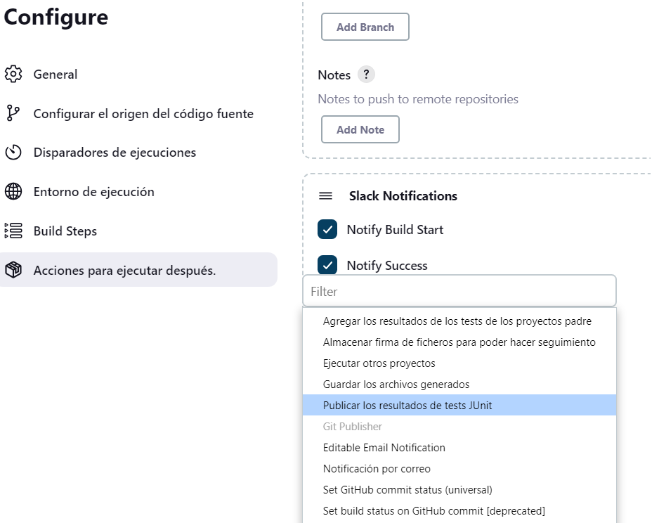
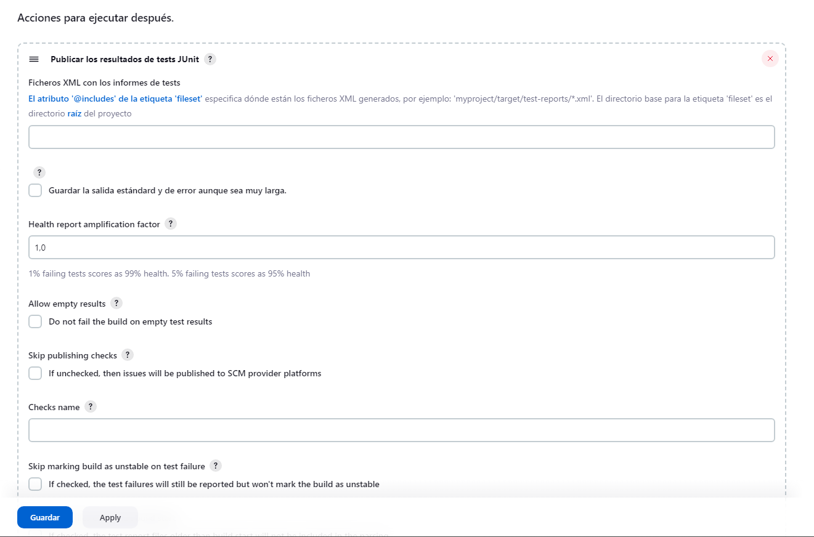
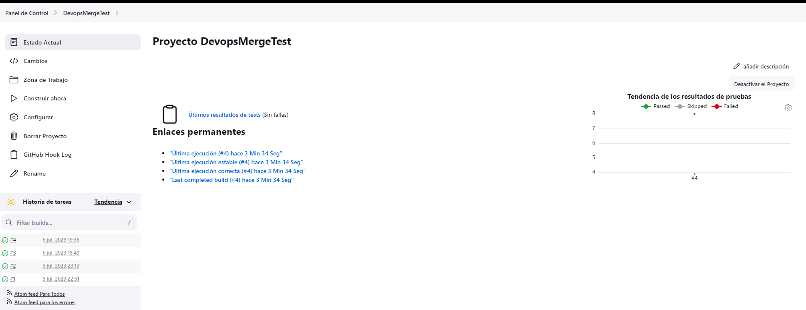
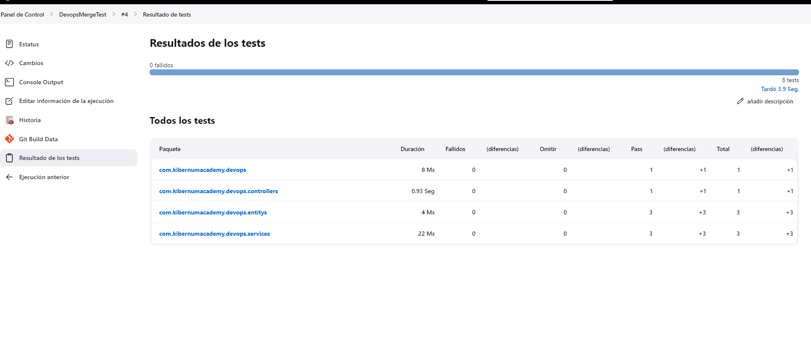

##  Vamos a recordar como Activar los reportes de JUnit

Seleccionamos "Zona de trabajo" y dentro del proyecto DevopsMergeTest se crean diferentes carpetas

Vamos a entrar la carpeta "target" y esperar a ver los "surefire-reports" damos click

Copiamos la ruta que para este caso seria 

DevopsMergeTest/target/surefire-reports

Nos vamos a la configuracion propia del "Pipe line"  Y vamos a "Acciones para ejecutar despues"

"Añadimos una Accion"

Por lo general la opción queda arriba asi subimos con el scroll hasta ubicar 

En "Ficheros XML con los informes de tests"

Pegamos la ruta: target/surefire-reports/*.xml

Apply y Save

Una vez que hacemos los cambios en el codigo subimos una rama con codigo propuesto que luego se fusione de manera automatica con la rama main, en el "Estado Actual" deberiamos ver lo siguiente

Observe de igual manera donde dice "Ultimos resultado de tests" hacemos click y deberiamos ver lo siguiente

