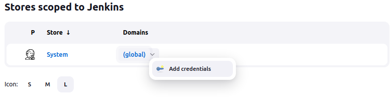

# GUIA DE PASOS PARA AGREGAR SSH a Jenkins para comunicarse con GITHUB

- Debemos Ingresar dentro de la imagen Jenkins y desde ahi crear las llaves

```shell
docker exec -ti jenkins bash
```

## Una vez ingresado a la Imagen Jenkins creamos las llaves

```shell
ssh-keygen -t rsa -b 4096 -C “tu_email@gmail.com”
```

- Enter file in which to save the key (/c/Users/miguel/.ssh/id_rsa):
- Enter passphrase (empty for no passphrase):
- Enter same passphrase again:

- Your identifaction has been saved in /c/Users/miguel/.ssh/id_rsa.
- Your public key has been saved in /c/Users/miguel/.ssh/id_rsa.pub.


## Para comprobarlo escribimos el comando:

```shell
ls -al ~/.ssh
```
## Evaluar el servidor ssh ver si esta funcionando

```shell
eval $(ssh-agent -s)
```

## Agregar la llave (privada al servidor ssh)

```shell
ssh-add ~/.ssh/id_rsa
```
## Copiar tu llave publica puedes usar cat

```shell
cat ~/.ssh/id_rsa.pub
```


# Agregamos la llave publica a github y ahora debemos agregar la llave privada a jenkins

- Vamos a Jenkins "Manage Jenkins" -> "Credentials"



## Copiar tu llave privada puedes usar editor cat

```shell
cat ~/.ssh/id_rsa
```
```shell
cd ~/.ssh/
ssh -T git@github.com

```
El comando ssh -T git@github.com se usa para probar tu conexión SSH con GitHub. Aquí está lo que hace cada parte del comando:

ssh: Este es el comando principal que inicia una conexión SSH.
-T: Esta opción desactiva la asignación de un pseudo-terminal o pseudo-TTY. Es útil cuando ejecutas un comando que no necesita una terminal, como git.
git@github.com: Este es el usuario y host al que te estás conectando. En este caso, estás usando la autenticación SSH para conectarte como el usuario "git" en "github.com", que es la forma estándar de autenticar las conexiones SSH con GitHub.
En conjunto, este comando intenta abrir una conexión SSH con GitHub. Si has configurado correctamente tu clave SSH, verás un mensaje de bienvenida de GitHub. Si la clave SSH no está configurada correctamente, recibirás un mensaje de error.

